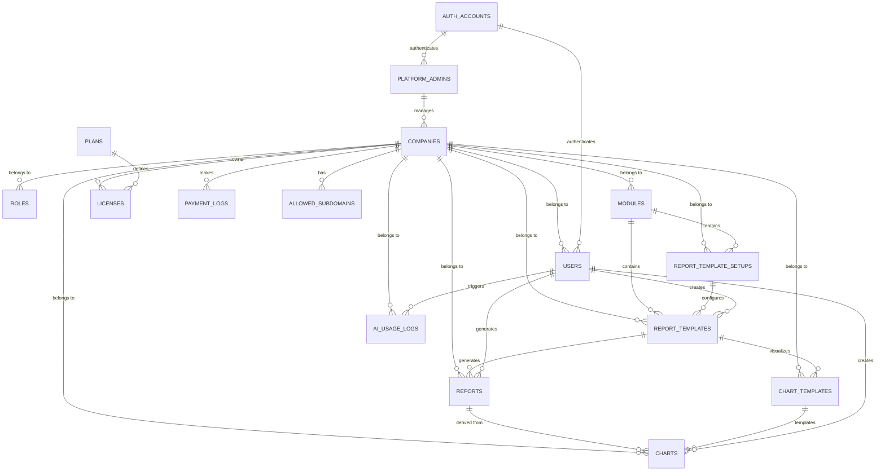

# DB Architecture (Supabase / PostgreSQL)

## Database System: PostgreSQL (Supabase)

## Patterns & Principles
- **Multi-tenant Isolation**: Every table includes a `company_id` for strict tenant isolation.
- **UUID Primary Keys**: All primary keys are UUIDs generated by `gen_random_uuid()`.
- **Timestamps**: All tables include `created_on` and `updated_on` using `timestamptz`.
- **Relational Integrity**: Foreign key constraints are enforced to maintain data consistency.
- **JSONB for Flexibility**: Configs, setup data, and AI-generated snapshots are stored in `jsonb` columns.
- **Row Level Security (RLS)**: Strictly enforced on all tables. Data is isolated by `company_id`.

## Security & Isolation (RLS)
Every table is protected by Row Level Security. A helper function `public.get_my_company_id()` is used to resolve the `company_id` of the currently authenticated user from the `users` table.

### Policy Logic
- **Isolation**: Users can only see/modify records where the `company_id` matches their own assigned `company_id`.
- **User Profiles**: Users can view all user profiles in their company but can only update their own profile (checked via `account_id = auth.uid()`).
- **AI Analytics**: Full CRUD access is granted to `report_templates`, `reports`, `chart_templates`, and `charts` within the user's company context.
- **Logs**: Users have read-only access to their company's AI usage logs.

> [!IMPORTANT]
> **Documentation Rule**: This file MUST be updated every time a database modification (DDL) is made. All new tables, columns, or relationship changes must be reflected here immediately to ensure architectural alignment.

## Entity Relationship Summary

## Detailed Table Definitions

### 1. auth_accounts
Authentication identities linked to Supabase Auth.
| Column | Type | Constraints | Description |
| :--- | :--- | :--- | :--- |
| `account_id` | uuid | PK, DEFAULT gen_random_uuid() | Unique ID mapping to `auth.users(id)` |
| `email` | varchar | UNIQUE, NOT NULL | Account email |
| `password_hash` | text | | Encrypted password |
| `account_type` | varchar | | User / Admin type |
| `created_at` | timestamptz | DEFAULT now() | Creation timestamp |
| `updated_at` | timestamptz | DEFAULT now() | Update timestamp |

### 2. companies
Root tenant table.
| Column | Type | Constraints | Description |
| :--- | :--- | :--- | :--- |
| `company_id` | uuid | PK, DEFAULT gen_random_uuid() | Unique ID for the company |
| `company_name` | varchar(150) | NOT NULL | Name of the company |
| `company_logo` | text | | URL to logo image |
| `company_address` | text | | Physical address |
| `license_key` | varchar(100) | UNIQUE | Unique license key |
| `plan_code` | varchar(50) | | Subscription plan code |
| `status` | varchar(20) | DEFAULT 'Active' | Active / Inactive / Suspended |
| `created_on` | timestamptz | DEFAULT now() | Creation timestamp |
| `updated_on` | timestamptz | DEFAULT now() | Last update timestamp |

### 3. platform_admins
Dedicated table for KiBiAI internal admins.
| Column | Type | Constraints | Description |
| :--- | :--- | :--- | :--- |
| `admin_id` | uuid | PK, DEFAULT gen_random_uuid() | Unique ID for the admin |
| `account_id` | uuid | UNIQUE, FK auth_accounts | Reference to Supabase Auth |
| `email` | varchar(150) | UNIQUE, NOT NULL | Admin email address |
| `is_active` | boolean | DEFAULT true | Activation status |
| `created_at` | timestamptz | DEFAULT now() | Creation timestamp |

### 4. users
Application users linked to Supabase Auth.
| Column | Type | Constraints | Description |
| :--- | :--- | :--- | :--- |
| `user_id` | uuid | PK, DEFAULT gen_random_uuid() | Unique ID for the user |
| `account_id` | uuid | FK -> auth_accounts | Reference to `auth.users(id)` |
| `company_id` | uuid | FK -> companies | Tenant association |
| `user_email` | varchar(150) | NOT NULL | User's email |
| `full_name` | varchar(150) | | Full name |
| `designation` | varchar(120) | | Job title |
| `user_status` | varchar(20) | DEFAULT 'Invited' | Active / Invited / Disabled |
| `role_id` | uuid | FK -> roles | Reference to the assigned role |
| `created_on` | timestamptz | DEFAULT now() | |
| `updated_on` | timestamptz | DEFAULT now() | |

### 5. roles
RBAC definitions.
| Column | Type | Constraints | Description |
| :--- | :--- | :--- | :--- |
| `role_id` | uuid | PK, DEFAULT gen_random_uuid() | |
| `company_id` | uuid | FK -> companies | |
| `role_name` | varchar(80) | NOT NULL | |
| `is_super_admin` | boolean | DEFAULT false | Bypass permission checks |
| `created_on` | timestamptz | DEFAULT now() | |

### 6. modules
High-level application modules.
| Column | Type | Constraints | Description |
| :--- | :--- | :--- | :--- |
| `module_id` | uuid | PK, DEFAULT gen_random_uuid() | |
| `company_id` | uuid | FK -> companies | |
| `module_name` | varchar(120) | NOT NULL | e.g. Sales, CRM |
| `module_code` | varchar(60) | NOT NULL | Internal reference |
| `module_status` | varchar(20) | DEFAULT 'Active' | |
| `created_on` | timestamptz | DEFAULT now() | |

### 7. report_templates
AI-generated report definitions.
| Column | Type | Constraints | Description |
| :--- | :--- | :--- | :--- |
| `report_template_id` | uuid | PK | |
| `company_id` | uuid | FK -> companies | |
| `module_id` | uuid | FK -> modules | |
| `report_template_name` | varchar(180) | NOT NULL | |
| `conversation_id` | varchar(120) | | AI session reference |
| `report_template_setup_json` | jsonb | | DB schema + connection config |
| `report_template_config_json` | jsonb | | Report logic generated by AI |
| `report_template_data_json` | jsonb | | Cached preview dataset |
| `report_template_insight` | text | | AI-generated insight |
| `report_template_status` | varchar(20) | DEFAULT 'Draft' | |
| `version_number` | integer | DEFAULT 1 | |
| `created_by_user_id` | uuid | FK -> users | |
| `created_on` | timestamptz | DEFAULT now() | |
| `updated_on` | timestamptz | DEFAULT now() | |
| `setup_id` | uuid | FK -> report_template_setups | Reusable configuration link |
| `chart_conversation_id` | varchar | | AI thread ID for Chart Builder session |
| `insight_conversation_id` | varchar | | OpenAI conversation ID for Business Insight Assistant session |
| `insight_results` | jsonb | | Persisted `InsightResult[]` — JS-computed from AI formulas, never raw data |

> **Migration**: `ai-workspace/sql/015-add-chart-conv-id.sql`  
> **Migration**: `ai-workspace/sql/023_add_insight_fields.sql`
> **Migration**: `ai-workspace/sql/025_reusable_setups.sql`

### 8. report_template_setups
Reusable database connection configurations.
| Column | Type | Constraints | Description |
| :--- | :--- | :--- | :--- |
| `setup_id` | uuid | PK | |
| `company_id` | uuid | FK -> companies | |
| `module_id` | uuid | FK -> modules | |
| `setup_name` | varchar(180) | NOT NULL | |
| `setup_description` | text | | Short description of the configuration |
| `setup_json` | jsonb | NOT NULL | |
| `created_by_user_id` | uuid | FK -> users | |
| `created_on` | timestamptz | DEFAULT now() | |
| `updated_on` | timestamptz | DEFAULT now() | |

### 9. reports
Snapshots of generated reports.
| Column | Type | Constraints | Description |
| :--- | :--- | :--- | :--- |
| `report_id` | uuid | PK | |
| `company_id` | uuid | FK -> companies | |
| `report_template_id` | uuid | FK -> report_templates | |
| `report_name` | varchar(180) | NOT NULL | |
| `report_config_json` | jsonb | | Runtime config snapshot |
| `report_data_json` | jsonb | | Final dataset (Immutable) |
| `report_insight` | text | | AI narrative summary |
| `generated_by_user_id` | uuid | FK -> users | |
| `created_on` | timestamptz | DEFAULT now() | |

### 9. chart_templates
Visual configuration for charts.
| Column | Type | Constraints | Description |
| :--- | :--- | :--- | :--- |
| `chart_template_id` | uuid | PK | |
| `company_id` | uuid | FK -> companies | |
| `report_template_id` | uuid | FK -> report_templates | |
| `conversation_id` | varchar(120) | | AI session reference |
| `chart_template_name` | varchar(180) | NOT NULL | |
| `chart_template_type` | varchar(40) | | Bar / Line / Pie / etc. |
| `chart_template_setup_json` | jsonb | | Axis, series config |
| `chart_template_dataset_json` | jsonb | | Schema mapping |
| `chart_template_canvas_state` | jsonb | | Dashboard layout state |
| `chart_template_status` | varchar(20) | DEFAULT 'Draft' | |
| `version_number` | integer | DEFAULT 1 | |
| `created_on` | timestamptz | DEFAULT now() | |
| `updated_on` | timestamptz | DEFAULT now() | |

### 10. charts
Rendered chart instances.
| Column | Type | Constraints | Description |
| :--- | :--- | :--- | :--- |
| `chart_id` | uuid | PK | |
| `company_id` | uuid | FK -> companies | |
| `chart_template_id` | uuid | FK -> chart_templates | |
| `report_id` | uuid | FK -> reports | Specific report source |
| `chart_name` | varchar(180) | NOT NULL | |
| `chart_type` | varchar(40) | | Output type |
| `chart_json` | jsonb | | Rendered chart config |
| `duplicate_of_chart_id` | uuid | FK -> charts | For cloned charts |
| `created_by_user_id` | uuid | FK -> users | |
| `created_on` | timestamptz | DEFAULT now() | |

### 11. ai_usage_logs
AI model consumption logs.
| Column | Type | Constraints | Description |
| :--- | :--- | :--- | :--- |
| `ai_usage_log_id` | uuid | PK | |
| `company_id` | uuid | FK -> companies | |
| `user_id` | uuid | FK -> users | |
| `entity_type` | varchar(30) | | Report / Chart / Template |
| `entity_id` | uuid | | Target entity ID |
| `model_name` | varchar(80) | | AI model used |
| `input_tokens` | integer | DEFAULT 0 | |
| `output_tokens` | integer | DEFAULT 0 | |
| `created_on` | timestamptz | DEFAULT now() | |

### 12. licenses
Replaces legacy licensing.
| Column | Type | Constraints | Description |
| :--- | :--- | :--- | :--- |
| `license_id` | uuid | PK, DEFAULT gen_random_uuid() | |
| `company_id` | uuid | FK -> companies | |
| `plan_name` | varchar(100) | | e.g. PRO, TEAMS |
| `price` | numeric(10,2) | | |
| `users_limit` | integer | | |
| `workspaces_limit` | integer | | |
| `reports_limit` | integer | | |
| `charts_limit` | integer | | |
| `ai_features` | varchar(100) | | |
| `licensing_terms` | varchar(150) | | |
| `support_level` | varchar(100) | | |
| `is_active` | boolean | DEFAULT true | |
| `expiry_date` | timestamptz | | |
| `created_on` | timestamptz | DEFAULT now() | |
| `updated_on` | timestamptz | DEFAULT now() | |

### 13. plans
Available subscription plans.
| Column | Type | Constraints | Description |
| :--- | :--- | :--- | :--- |
| `plan_id` | uuid | PK, DEFAULT gen_random_uuid() | |
| `plan_name` | varchar(100) | UNIQUE | |
| `plan_price` | numeric(10,2) | | |
| `stripe_product_id` | varchar(150) | | |
| `stripe_response_json` | jsonb | | |
| `created_on` | timestamptz | DEFAULT now() | |

### 14. promocodes
Discount codes for subscriptions.
| Column | Type | Constraints | Description |
| :--- | :--- | :--- | :--- |
| `promocode_id` | uuid | PK, DEFAULT gen_random_uuid() | |
| `code` | varchar(50) | UNIQUE | |
| `percent_off` | numeric(5,2) | | |
| `max_redemptions` | integer | | |
| `redemptions_count` | integer | DEFAULT 0 | |
| `expires_at` | timestamptz | | |
| `is_active` | boolean | DEFAULT true | |
| `created_on` | timestamptz | DEFAULT now() | |

### 15. payment_logs
Replaces FileMaker PaymentLog.
| Column | Type | Constraints | Description |
| :--- | :--- | :--- | :--- |
| `payment_id` | uuid | PK, DEFAULT gen_random_uuid() | |
| `company_id` | uuid | FK -> companies | |
| `api_request` | jsonb | | Request payload to Stripe/etc |
| `api_response` | jsonb | | Response from Stripe/etc |
| `status` | varchar(50) | | |
| `created_on` | timestamptz | DEFAULT now() | |

### 16. user_module_access
Tracks which modules a user has access to.
| Column | Type | Constraints | Description |
| :--- | :--- | :--- | :--- |
| `user_id` | uuid | PK, FK -> users | |
| `module_id` | uuid | PK, FK -> modules | |
| `company_id` | uuid | FK -> companies | |
| `created_at` | timestamptz | DEFAULT now() | |

### 17. user_template_permissions
Tracks granular permissions for a user on a specific report template.
| Column | Type | Constraints | Description |
| :--- | :--- | :--- | :--- |
| `user_id` | uuid | PK, FK -> users | |
| `report_template_id` | uuid | PK, FK -> report_templates | |
| `company_id` | uuid | FK -> companies | |
| `can_generate_report` | boolean | DEFAULT false | |
| `can_modify_template` | boolean | DEFAULT false | |
| `can_create_template` | boolean | DEFAULT false | |
| `can_delete_template` | boolean | DEFAULT false | |
| `can_generate_charts` | boolean | DEFAULT false | **Renamed** from `can_create_charts` (T-016) — user-level: run chart templates on saved reports |
| `can_analyze_charts` | boolean | DEFAULT false | **New** (T-016) — admin-level: AI-powered chart template creation/analysis |
| `created_at` | timestamptz | DEFAULT now() | |
| `updated_at` | timestamptz | DEFAULT now() | |

> **Migration**: `ai-workspace/sql/016_access_control_permissions.sql`

### 18. allowed_subdomains
Registry of valid company subdomains for subdomain-based routing.
> **Added**: T-014 — Subdomain-Based Routing
| Column | Type | Constraints | Description |
| :--- | :--- | :--- | :--- |
| `subdomain_id` | uuid | PK, DEFAULT gen_random_uuid() | Unique ID |
| `slug` | varchar(120) | UNIQUE, NOT NULL | Kebab-case company slug (e.g. "acme-corp") |
| `company_id` | uuid | FK -> companies (ON DELETE CASCADE) | Tenant association |
| `is_active` | boolean | NOT NULL, DEFAULT true | When false, subdomain is blocked |
| `created_on` | timestamptz | DEFAULT now() | |
| `updated_on` | timestamptz | DEFAULT now() | Auto-updated via trigger |

> **Notes**:
> - The `admin` subdomain is **reserved** and NOT stored in this table — it is hardcoded in `middleware.ts`.
> - Reserved slugs blocked at company creation: `admin`, `api`, `www`, `kibiai`, `app`, `mail`, `ftp`, `support`, `help`, `static`, `assets`.
> - RLS: Public `SELECT` on `is_active = true` rows (for middleware validation). All writes via service role only.
> - Migration file: `ai-workspace/sql/014_allowed_subdomains.sql`
