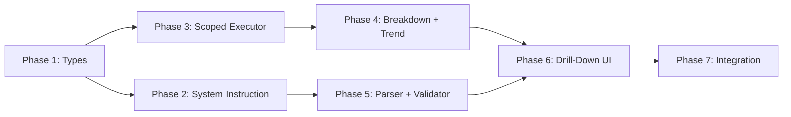

# Business Insight Engine: v2 → v3 Migration Plan

> **Scope**: fullstack | **Complexity**: 5x v2 | **Est. Phases**: 7 | **Est. Tickets**: ~18

---

## 1. Architecture Comparison: v2 vs v3

| Dimension | v2 (Current) | v3 (Target) |
|---|---|---|
| **AI Output** | Flat `{ insights: [...] }` | Array with `drill_down`, `visualization`, `overview_kpis`, callouts |
| **Calculation Scope** | Implicit (all treated same) | Explicit: `per_record` / `period` / `derived` |
| **Breakdown** | ❌ Banned (group-by forbidden) | ✅ `drill_down.breakdown_by` — JS partitions data |
| **Trend Charts** | ❌ Not supported | ✅ `trend_bucket` + `visualization` config |
| **Calc Trace** | ❌ Not supported | ✅ `calc_trace` ordered array |
| **KPI Cards** | ❌ Not supported | ✅ `overview_kpis` with highlights |
| **Input Format** | `{ module, fields }` | `{ module, fields, data_stats, report_period, targets }` |
| **Severity** | Static thresholds | Dynamic: can reference `avg`, `max`, `min` from `data_stats` |
| **Data Quality** | ❌ Not supported | ✅ `data_quality_check` with `min_threshold` |
| **Callouts** | ❌ Not supported | ✅ `risk_callout`, `decision_callout`, `action_callout` |
| **NL Tokens** | ❌ Not supported | ✅ `trend_direction`, `consecutive_periods` |
| **Formula Whitelist** | SUM/SUMIFS/COUNTIFS/IF/etc. | Same + `IFERROR` added |
| **UI** | Simple card with text | 4-tab drill-down modal (Overview, Breakdown, Trend, Calc Trace) |

---

## 2. Existing File Inventory (What Changes)

### Files to MODIFY

| File | Change Type | What Changes |
|---|---|---|
| [types.ts](file:///e:/Dev/Next%20JS/kibiai/src/lib/insights/types.ts) | **Major rewrite** | New v3 types: scoped calcs, drill_down, visualization, callouts |
| [insightFormulaExecutor.ts](file:///e:/Dev/Next%20JS/kibiai/src/lib/insights/insightFormulaExecutor.ts) | **Major rewrite** | Scope-aware execution, dependency graph, virtual field materialization |
| [insightResponseParser.ts](file:///e:/Dev/Next%20JS/kibiai/src/lib/insights/insightResponseParser.ts) | **Moderate** | Parse v3 array format, validate new fields |
| [fieldSchemaAdapter.ts](file:///e:/Dev/Next%20JS/kibiai/src/lib/insights/fieldSchemaAdapter.ts) | **Moderate** | Add `data_stats` computation, `targets` passthrough |
| [businessInsightSystemInstruction.ts](file:///e:/Dev/Next%20JS/kibiai/src/constants/businessInsightSystemInstruction.ts) | **Full rewrite** | Entire v3 system instruction |
| [insightPromptFormatter.ts](file:///e:/Dev/Next%20JS/kibiai/src/lib/bot/insightPromptFormatter.ts) | **Moderate** | New input format with `data_stats`, `report_period`, `targets` |
| [insightPromptOptions.ts](file:///e:/Dev/Next%20JS/kibiai/src/constants/insightPromptOptions.ts) | **Minor** | Add drill-down related prompt options |
| [InsightCard.tsx](file:///e:/Dev/Next%20JS/kibiai/src/components/insights/InsightCard.tsx) | **Moderate** | Add click-to-drill-down, callout rendering |
| [InsightDashboard.tsx](file:///e:/Dev/Next%20JS/kibiai/src/components/insights/InsightDashboard.tsx) | **Moderate** | Wire drill-down modal, pass dataset |
| [insightContextBuilder.ts](file:///e:/Dev/Next%20JS/kibiai/src/lib/charts/insightContextBuilder.ts) | **Moderate** | Emit `report_period` with `previous_start`/`previous_end` |
| [insight-thread/route.ts](file:///e:/Dev/Next%20JS/kibiai/src/app/api/report-templates/%5Btemplate_id%5D/insight-thread/route.ts) | **Minor** | Schema update for new v3 result shape |

### Files to CREATE (New)

| File | Purpose |
|---|---|
| `src/lib/insights/v3/scopedExecutor.ts` | Scope-aware calc engine (`per_record` → `period` → `derived`) |
| `src/lib/insights/v3/breakdownEngine.ts` | Partition dataset by dimension, compute per-group metrics |
| `src/lib/insights/v3/trendEngine.ts` | Bucket rows by day/week/month, generate chart series |
| `src/lib/insights/v3/calcTraceBuilder.ts` | Build ordered trace with resolved values |
| `src/lib/insights/v3/dataQualityValidator.ts` | Record count checks, suppress weak insights |
| `src/lib/insights/v3/nlTokenResolver.ts` | Resolve `trend_direction`, `consecutive_periods` |
| `src/lib/insights/v3/severityEvaluator.ts` | Stats-aware severity with `avg`/`max`/`min` injection |
| `src/lib/insights/v3/dataStatsComputer.ts` | Compute `avg`/`max`/`min` per numeric field from dataset |
| `src/lib/insights/v3/insightValidator.ts` | Pre-execution validation (fields exist, no circular deps, etc.) |
| `src/components/insights/InsightDrillDownModal.tsx` | 4-tab drill-down modal container |
| `src/components/insights/tabs/OverviewTab.tsx` | KPI cards, comparison chips, callouts |
| `src/components/insights/tabs/BreakdownTab.tsx` | Grouped table with share %, distribution bars |
| `src/components/insights/tabs/TrendTab.tsx` | Line/bar chart using existing chart library |
| `src/components/insights/tabs/CalcTraceTab.tsx` | Ordered formula chain with scope + resolved values |

---

## 3. Execution Phases

### Phase 1: v3 Type System
**Ticket**: `ST-v3-01` | **Scope**: frontend + backend | **Files**: 1 modified, 0 new

**Goal**: Define all v3 TypeScript interfaces without breaking v2.

**Tasks**:
1. Add new interfaces alongside existing v2 types (keep backward compat)
2. New types needed:

```typescript
// Scoped calculation
interface AICalculationV3 {
  scope: "per_record" | "period" | "derived";
  description: string;
  formula: string;
}

// Drill-down config
interface DrillDownConfig {
  breakdown_by: string;
  calc_trace: string[];
  overview_kpis: OverviewKPI[];
  trend_bucket: "day" | "week" | "month";
}

interface OverviewKPI {
  key: string;
  label: string;
  highlighted?: boolean;
}

// Visualization config
interface VisualizationConfig {
  type: "line" | "bar" | "table";
  trend_metric: string;
  date_field: string;
  breakdown_metric?: string;
  sort_by?: string;
  limit?: number;
}

// Data quality
interface DataQualityCheck {
  required: boolean;
  min_threshold: number;
}

// Full v3 insight item
interface AIInsightItemV3 {
  id: string;
  group: string;
  category: InsightCategory;
  priority_tag: string;
  severity_color: string;
  statement_template: string;
  summary_template?: string;
  calculations: Record<string, AICalculationV3>;
  severity_logic: Record<string, string>;
  risk_callout?: string;
  decision_callout?: string;
  action_callout?: string;
  data_quality_check?: DataQualityCheck;
  drill_down: DrillDownConfig;
  visualization?: VisualizationConfig;
}

// Extended result with drill-down data
interface InsightResultV3 extends InsightResult {
  group: string;
  priority_tag: string;
  severity_color: string;
  summary?: string;
  risk_callout?: string;
  decision_callout?: string;
  action_callout?: string;
  drill_down: {
    breakdown_by: string;
    breakdownData?: BreakdownRow[];
    trendData?: TrendPoint[];
    calcTrace?: CalcTraceEntry[];
    overviewKpis?: ResolvedKPI[];
  };
}
```

**Acceptance**: All existing v2 code compiles without changes. New types exported.

---

### Phase 2: v3 System Instruction + Input Format
**Ticket**: `ST-v3-02` | **Scope**: backend | **Files**: 2 modified

**Goal**: Update AI prompt + input format to produce v3-shaped output.

#### 2a. System Instruction Rewrite
- [businessInsightSystemInstruction.ts](file:///e:/Dev/Next%20JS/kibiai/src/constants/businessInsightSystemInstruction.ts)
- Replace entire `BUSINESS_INSIGHT_SYSTEM_INSTRUCTION` with v3 spec from [Business_Insight_v3.txt](file:///e:/Dev/Next%20JS/kibiai/ai-workspace/docs/misc/Business_Insight_v3.txt) lines 576–633
- Key changes:
  - Output is JSON **array** (not `{ insights: [...] }`)
  - Every insight MUST include `drill_down` block
  - Scope tags on every calculation
  - `IFERROR` added to function whitelist
  - `data_quality_check` required for SUMIFS/COUNTIFS insights
  - Callout rules (risk = specific consequence, decision = binary choice, action = concrete step)

#### 2b. Input Format Extension
- [insightPromptFormatter.ts](file:///e:/Dev/Next%20JS/kibiai/src/lib/bot/insightPromptFormatter.ts)
- [fieldSchemaAdapter.ts](file:///e:/Dev/Next%20JS/kibiai/src/lib/insights/fieldSchemaAdapter.ts)
- New input shape:
```json
{
  "module": "Sales",
  "fields": { "fieldName": "date|number|text|boolean" },
  "data_stats": { "fieldName": { "avg": 100, "max": 500, "min": 5 } },
  "report_period": {
    "start": "REPORT_START",
    "end": "REPORT_END",
    "previous_start": "PREV_START",
    "previous_end": "PREV_END",
    "midpoint": "REPORT_MIDPOINT"
  },
  "targets": { "revenue": "TARGET_REVENUE" }
}
```
- Create `dataStatsComputer.ts`: iterates dataset, computes avg/max/min per numeric field
- Modify `insightContextBuilder.ts`: emit `previous_start`/`previous_end`

**Acceptance**: AI receives v3 input and returns v3-shaped JSON array.

---

### Phase 3: Scoped Calculation Executor
**Ticket**: `ST-v3-03` | **Scope**: backend | **Files**: 1 modified, 2 new

**Goal**: Replace flat execution with scope-aware 3-pass engine.

#### Current State (v2)
[insightFormulaExecutor.ts](file:///e:/Dev/Next%20JS/kibiai/src/lib/insights/insightFormulaExecutor.ts) — single loop with `isRowLevelFormula()` heuristic detection.

#### Target State (v3)
Three explicit passes driven by `scope` tag:

| Pass | Scope | Action |
|---|---|---|
| 1 | `per_record` | Iterate dataset, compute value per row, materialize as virtual column |
| 2 | `period` | Aggregate over filtered window (SUMIFS/COUNTIFS) using HyperFormula |
| 3 | `derived` | Scalar-on-scalar arithmetic from resolved metrics registry |

**New file**: `src/lib/insights/v3/scopedExecutor.ts`

```
Key functions:
├── executeV3InsightPlan(plan, dataset, context)
│   ├── buildDependencyGraph(calculations)
│   ├── topologicalSort(graph) — detect circular refs
│   ├── Pass 1: materializePerRecordFields(dataset, perRecordCalcs)
│   ├── Pass 2: evaluatePeriodAggregates(dataset, periodCalcs, virtualFields)
│   └── Pass 3: resolveDerivedMetrics(derivedCalcs, metricRegistry)
```

**Key difference from v2**: No more `isRowLevelFormula()` heuristic. The AI explicitly tags scope → executor follows.

**Migration strategy**: Keep v2 `executeInsightPlan()` intact. New `executeV3InsightPlan()` sits alongside. The response parser detects v3 shape and routes to v3 executor.

**Acceptance**: All 3 scope types evaluate correctly. Dependency chain resolves in order. Circular refs detected and rejected.

---

### Phase 4: Breakdown + Trend Engines
**Ticket**: `ST-v3-04` | **Scope**: backend | **Files**: 0 modified, 2 new

#### 4a. Breakdown Engine (`breakdownEngine.ts`)

```
Input:  dataset[], breakdownField, metricCalcs, context
Output: BreakdownRow[] — one per group

Steps:
1. Partition dataset by breakdownField value
2. For each partition:
   a. Run per_record materialization
   b. Run period aggregation
   c. Store group metric value
3. Compute totals across all groups
4. Compute share_pct = (group_value / total) * 100
5. Sort by metric descending
6. Apply limit (from visualization.limit)
```

```typescript
interface BreakdownRow {
  groupKey: string;
  metrics: Record<string, number>;
  share_pct: number;
}
```

#### 4b. Trend Engine (`trendEngine.ts`)

```
Input:  dataset[], trendMetric, dateField, trendBucket, context
Output: TrendPoint[]

Steps:
1. Filter dataset to report period
2. Bucket rows by day/week/month
3. For each bucket:
   a. Materialize per_record fields
   b. Aggregate trend_metric
4. Generate label (e.g., "WK 1 (APR 1—7)")
5. Return chart-ready series
```

```typescript
interface TrendPoint {
  label: string;
  value: number;
  bucketStart: string;
  bucketEnd: string;
}
```

**Acceptance**: Breakdown generates correct share % and sorts. Trend buckets correctly by week/month/day.

---

### Phase 5: Response Parser + Validator + NL Tokens
**Ticket**: `ST-v3-05` | **Scope**: backend | **Files**: 1 modified, 3 new

#### 5a. Response Parser Update
- [insightResponseParser.ts](file:///e:/Dev/Next%20JS/kibiai/src/lib/insights/insightResponseParser.ts)
- Detect v3 format: input is JSON **array** (not `{ insights: [...] }`)
- Validate each item has: `id`, `group`, `category`, `drill_down`, `calculations` with `scope`
- Return `AIInsightPlanV3` or fall back to v2 parsing

#### 5b. Insight Validator (`insightValidator.ts`)
Pre-execution checks:
- All referenced fields exist in schema
- All referenced calculations exist
- Only supported functions used
- Scopes are valid enum values
- No circular dependencies in calc graph
- `breakdown_by` field exists in schema
- `trend_metric` references valid calculation
- All placeholders have matching calculations

#### 5c. NL Token Resolver (`nlTokenResolver.ts`)
Runtime placeholder resolution:
- `{trend_direction}` → "increased" / "declined" / "remained stable" (based on delta sign)
- `{consecutive_periods}` → streak count of same-direction delta

#### 5d. Data Quality Validator (`dataQualityValidator.ts`)
- Check record count against `min_threshold`
- Return `pass`/`warn`/`suppress` state
- Insights below threshold get suppressed or flagged

**Acceptance**: v3 responses parse correctly. Invalid insights rejected. NL tokens resolve dynamically.

---

### Phase 6: Drill-Down Modal UI
**Ticket**: `ST-v3-06` | **Scope**: frontend | **Files**: 2 modified, 5 new

> [!IMPORTANT]
> This is the most visible user-facing change. The modal must match the screenshots provided (Overview → Breakdown → Trend → Calc Trace tabs).

#### 6a. InsightCard Update
- Add click handler → opens drill-down modal
- Render callout badges (risk/decision/action)
- Show `priority_tag` and `severity_color`
- Display `summary_template` text below headline

#### 6b. Drill-Down Modal (`InsightDrillDownModal.tsx`)

```
┌─────────────────────────────────────────┐
│ [Finance] [Opportunity]            [✕]  │
│                                         │
│ Revenue grew 38.3% vs prior period      │
│ Current period $38,950 vs $28,160       │
│                                         │
│ ┌──────────┬──────────┬───────┬───────┐ │
│ │ Overview │Breakdown │ Trend │ Trace │ │
│ └──────────┴──────────┴───────┴───────┘ │
│                                         │
│  [Tab Content Area]                     │
│                                         │
│ ⚡ Decision: Expand pipeline...         │
└─────────────────────────────────────────┘
```

#### 6c. Tab Components

**OverviewTab.tsx**:
- KPI metric cards (up to 6, max 2 highlighted)
- Comparison chips (+38.3%, −51.3%)
- Color-coded values (green positive, red negative)

**BreakdownTab.tsx**:
- Grouped table: Group Key | Metric Value | Share % | Distribution Bar
- Horizontal bar fills proportional to share
- Sorted descending by metric

**TrendTab.tsx**:
- SVG or Highcharts line chart
- Weekly/monthly labels
- Gradient fill under line
- Tooltip on hover

**CalcTraceTab.tsx**:
- Ordered list of calculations
- Shows: name | formula | scope tag | resolved value
- Visual dependency chain (top to bottom)

#### 6d. Callout Rendering
- Bottom of modal (or Overview tab)
- Three callout types with distinct icons:
  - ⚡ Decision (yellow)
  - 🔴 Risk (red)
  - ✅ Action (green)

**Acceptance**: All 4 tabs render correctly. Modal opens/closes. Responsive layout.

---

### Phase 7: Integration, Testing & Backward Compat
**Ticket**: `ST-v3-07` | **Scope**: fullstack | **Files**: multiple

#### 7a. Backward Compatibility Layer
- `executeInsightPlan()` still works for v2 plans
- Response parser auto-detects v2 vs v3 shape
- `InsightCard` renders both v2 (`InsightResult`) and v3 (`InsightResultV3`)
- Feature flag: `ENABLE_INSIGHT_V3` environment variable

#### 7b. Dashboard Integration
- [InsightDashboard.tsx](file:///e:/Dev/Next%20JS/kibiai/src/components/insights/InsightDashboard.tsx) passes dataset to drill-down modal
- [DashboardContext.tsx](file:///e:/Dev/Next%20JS/kibiai/src/context/DashboardContext.tsx) stores v3 results
- Chart dashboard [InsightCard.tsx](file:///e:/Dev/Next%20JS/kibiai/src/components/chart-dashboard/InsightCard.tsx) updated for v3

#### 7c. API Route Update
- [insight-thread/route.ts](file:///e:/Dev/Next%20JS/kibiai/src/app/api/report-templates/%5Btemplate_id%5D/insight-thread/route.ts)
- Accept v3 result shape in Zod schema
- Persist drill-down metadata

#### 7d. Testing Matrix

| Test | What to Verify |
|---|---|
| Parser v2 compat | Old `{ insights: [...] }` still parses |
| Parser v3 array | New array format parses correctly |
| Scope: per_record | Virtual columns materialize |
| Scope: period | SUMIFS/COUNTIFS aggregate correctly |
| Scope: derived | Scalar-on-scalar resolves |
| Dependency graph | Circular refs detected |
| Breakdown engine | Partition + share % correct |
| Trend engine | Week/month bucketing correct |
| Data quality | Below-threshold insights suppressed |
| Severity w/ stats | `avg * 1.2` thresholds resolve |
| NL tokens | trend_direction resolves dynamically |
| Drill-down modal | All 4 tabs render |
| Backward compat | v2 insights still render |

---

## 4. Dependency Graph (Phase Order)



**Critical path**: P1 → P3 → P4 → P6 → P7

---

## 5. Risk Analysis

| Risk | Impact | Mitigation |
|---|---|---|
| AI returns inconsistent v3 format | High | Strict validation in parser + binding examples in prompt |
| HyperFormula can't handle `IFERROR` | Medium | Polyfill IFERROR as `=IF(ISERROR(expr), fallback, expr)` |
| Breakdown on high-cardinality fields | Medium | Enforce `visualization.limit` (default 10) |
| Trend bucketing edge cases (DST, partial weeks) | Low | Use ISO week numbers, handle timezone in toIsoDate |
| v2 → v3 data migration for existing insights | Medium | Keep v2 results as-is; v3 only for new generations |
| Large dataset performance in breakdown | Medium | Limit to first 5000 records for breakdown/trend |

---

## 6. Migration Strategy

> [!WARNING]
> Do NOT delete v2 code until v3 is fully validated in production.

1. **Phase 1-3**: Pure additive. No v2 code changes. New files only.
2. **Phase 4-5**: New engines. v2 executor untouched.
3. **Phase 6**: UI additions. InsightCard gets v3 rendering alongside v2.
4. **Phase 7**: Feature flag gates v3 path. Toggle per-company if needed.
5. **Post-validation**: Deprecate v2 types, remove feature flag.

---

## 7. File Tree Summary (Final State)

```
src/lib/insights/
├── types.ts                    # MODIFIED — v2 + v3 types
├── fieldSchemaAdapter.ts       # MODIFIED — data_stats support
├── insightResponseParser.ts    # MODIFIED — v2/v3 auto-detect
├── insightFormulaExecutor.ts   # PRESERVED — v2 executor (no changes)
└── v3/
    ├── scopedExecutor.ts       # NEW — 3-pass scope-aware engine
    ├── breakdownEngine.ts      # NEW — group-by partition + share %
    ├── trendEngine.ts          # NEW — time bucketing + chart series
    ├── calcTraceBuilder.ts     # NEW — ordered trace with values
    ├── dataQualityValidator.ts # NEW — record count validation
    ├── nlTokenResolver.ts      # NEW — trend_direction, streaks
    ├── severityEvaluator.ts    # NEW — stats-aware severity
    ├── dataStatsComputer.ts    # NEW — avg/max/min computation
    └── insightValidator.ts     # NEW — pre-execution validation

src/components/insights/
├── InsightCard.tsx             # MODIFIED — click-to-drill, callouts
├── InsightDashboard.tsx        # MODIFIED — wire modal, pass dataset
├── InsightDrillDownModal.tsx   # NEW — 4-tab modal container
└── tabs/
    ├── OverviewTab.tsx         # NEW — KPI cards + callouts
    ├── BreakdownTab.tsx        # NEW — grouped table + bars
    ├── TrendTab.tsx            # NEW — line/bar chart
    └── CalcTraceTab.tsx        # NEW — formula trace table

src/constants/
├── businessInsightSystemInstruction.ts  # REWRITTEN — v3 prompt
└── insightPromptOptions.ts              # MODIFIED — new options

src/lib/bot/
└── insightPromptFormatter.ts            # MODIFIED — v3 input format

src/lib/charts/
└── insightContextBuilder.ts             # MODIFIED — prev period support
```

**Total: 11 modified files + 14 new files = 25 files**
